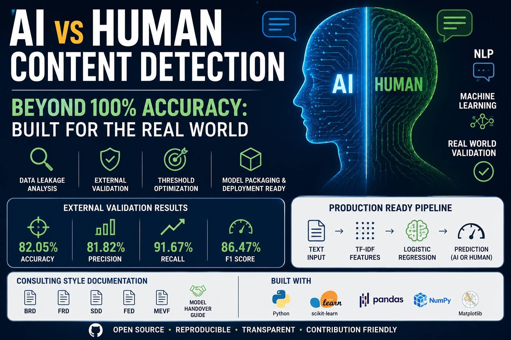
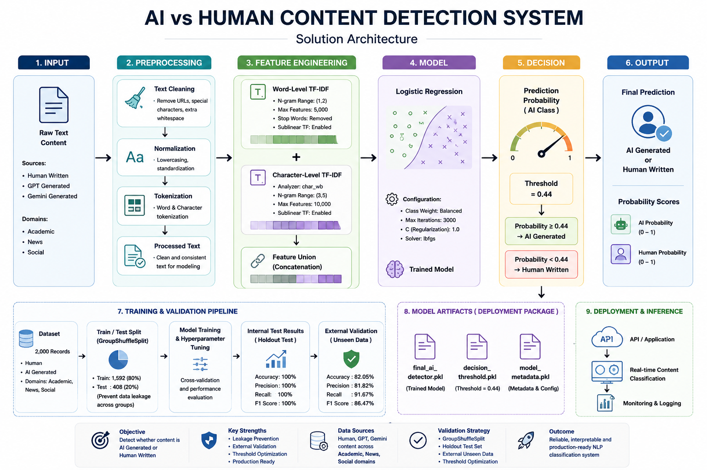
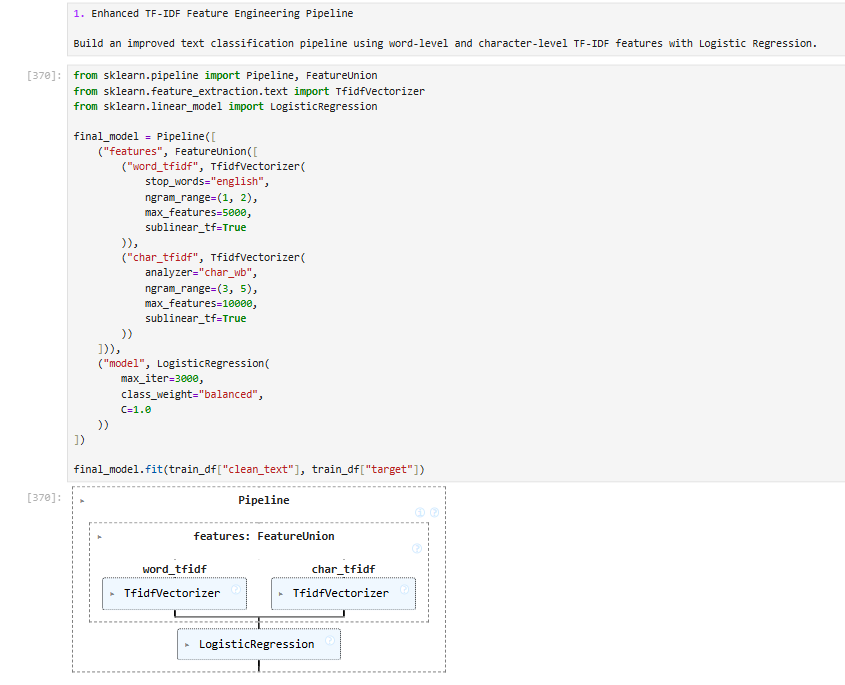
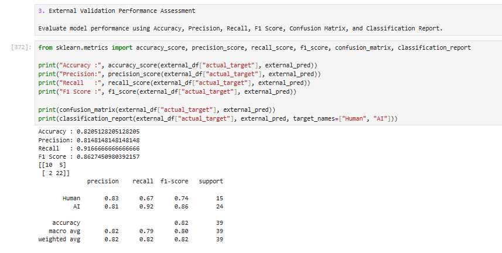
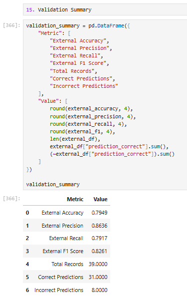

# AI vs Human Content Detection System


## Overview

This project delivers a production-ready Machine Learning solution capable of classifying textual content as either **AI Generated** or **Human Written**.

The solution was developed to support content moderation workflows across multiple domains including:

* Academic Content
* News Content
* Social Content

The project follows a complete machine learning lifecycle covering:

* Data Validation
* Exploratory Data Analysis (EDA)
* Feature Engineering
* Model Development
* Leakage Investigation
* External Validation
* Threshold Optimization
* Model Serialization
* Deployment Packaging

---

## Business Problem

The rapid growth of Generative AI has made it increasingly difficult for digital platforms to distinguish between AI-generated and human-authored content.

This project aims to automate content classification while maintaining scalability, consistency, and operational efficiency.

---

## Final Solution Architecture



---

## Model Pipeline



---

## Model Configuration

### Feature Engineering

**Word-Level TF-IDF**

* Unigrams & Bigrams
* Max Features: 5,000

**Character-Level TF-IDF**

* Character N-Grams (3–5)
* Max Features: 10,000

### Classifier

* Logistic Regression
* Class Weight: Balanced
* Max Iterations: 3000

### Decision Threshold

```python
AI_THRESHOLD = 0.44
```

---

## Validation Results

### Internal Validation

| Metric    | Score   |
| --------- | ------- |
| Accuracy  | 100.00% |
| Precision | 100.00% |
| Recall    | 100.00% |
| F1 Score  | 100.00% |

### External Validation

## External Validation Results



## Error Analysis



---

## Project Structure

```text
AI-vs-Human-Content-Detection/

├── AI_vs_Human_Detection.ipynb
├── AI_vs_Human_Detection.py
├── requirements.txt
├── README.md
```

---

## Installation

```bash
pip install -r requirements.txt
```

Dependencies are listed in [requirements.txt](requirements.txt).

## Quick Start

```python
import joblib

model = joblib.load("model/final_ai_detector.pkl")
threshold = joblib.load("model/decision_threshold.pkl")
```

---

## Key Highlights

* Production-Oriented NLP Pipeline
* Leakage Investigation Using GroupShuffleSplit
* External Validation Using Independent Dataset
* Threshold Optimization
* Model Serialization with Joblib
* Deployment-Ready Artifacts
* Comprehensive Documentation Suite

---

## Future Improvements

* Transformer-Based Models (BERT, RoBERTa)
* Multilingual Support
* Real-Time API Deployment
* Continuous Monitoring Framework
* Expanded Validation Datasets

---

## Author

**M. Sagar Reddy**

Data Science and AI | Machine Learning | NLP

---

## License

This project is released under the MIT License.
